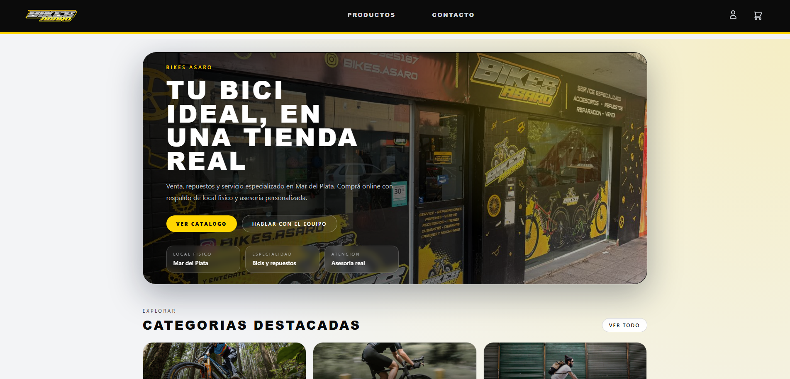
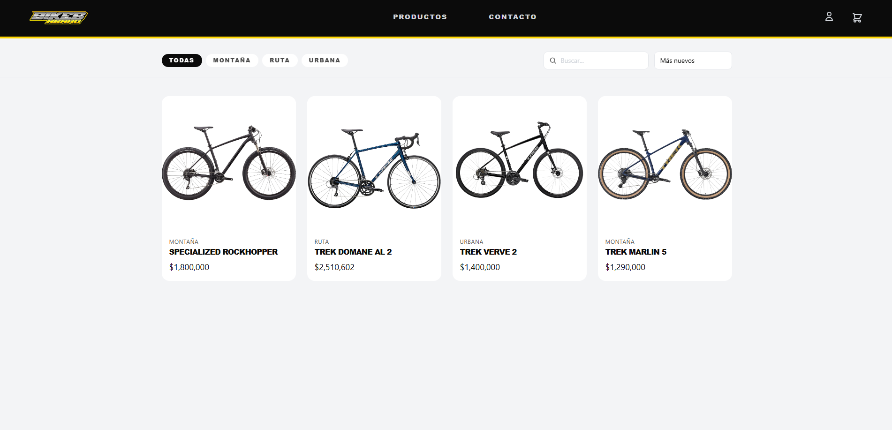
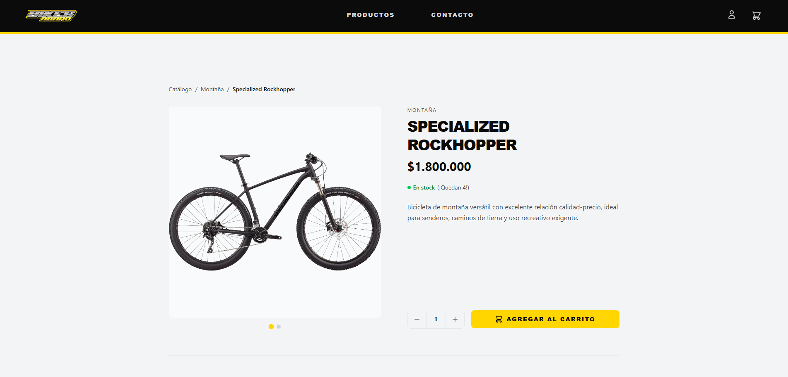
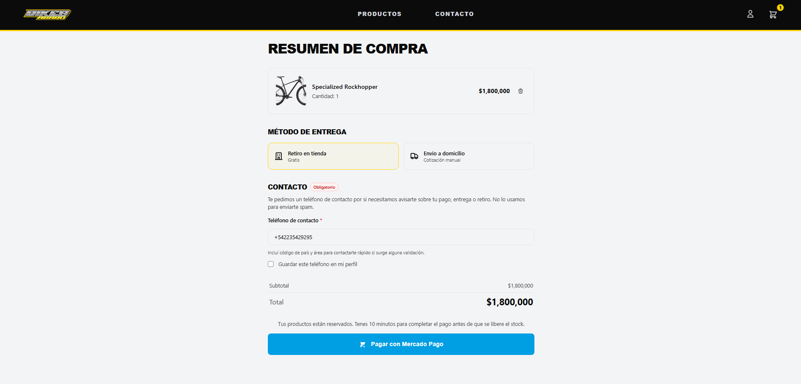
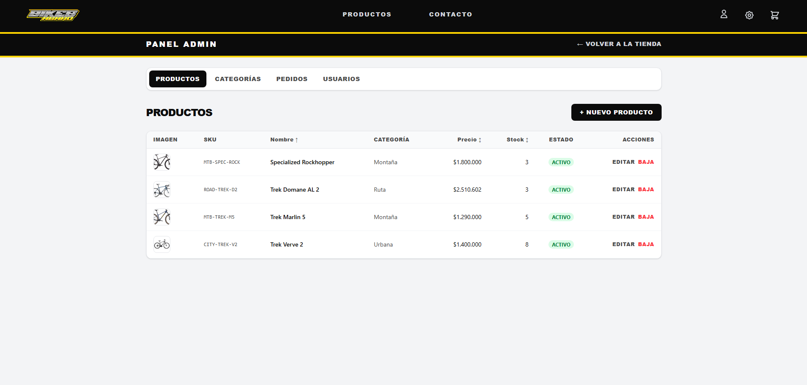

<p align="center">
  
</p>

# Bikes Asaro

Angular client for **Bikes Asaro**, a full-stack e-commerce platform focused on bicycle sales, catalog management, secure checkout, and operational administration, integrated with the custom **bikestore-api** backend built with Java and Spring Boot.

## Screenshots

<table>
  <tr>
    <td align="center">
      <strong>Home Page</strong><br />
      
    </td>
    <td align="center">
      <strong>Product Catalog</strong><br />
      
    </td>
  </tr>
  <tr>
    <td align="center">
      <strong>Product Details</strong><br />
      
    </td>
    <td align="center">
      <strong>Checkout Process</strong><br />
      
    </td>
  </tr>
  <tr>
    <td colspan="2" align="center">
      <strong>Admin Dashboard</strong><br />
      
    </td>
  </tr>
</table>

## Key Features & AI Integration

- **Storefront experience:** home page highlights, category discovery, searchable catalog, product detail views, and persistent cart state.
- **Checkout workflow:** integrated purchase flow with store pickup or shipping, shipping quote estimation, payment handoff, and order tracking.
- **Administrative workspace:** protected admin area for managing products, categories, users, and orders.
- **Customer account flows:** registration, login, email verification, password recovery, profile management, and order history.
- **AI-powered image cropping:** product image preparation uses **WebAssembly** through **ONNX Runtime Web** and `@imgly/background-removal` to run image-processing models directly in the browser. This enables client-side background removal before upload, reducing backend processing and improving the admin media workflow.

## Security & Authentication

The Angular client is tightly integrated with the backend security model exposed by `bikestore-api`:

- **Google OAuth2 login:** the login view initializes Google Identity Services in the browser, captures the Google credential token, and exchanges it with the backend through `/auth/google`.
- **JWT session state:** after email/password or Google authentication, the backend-issued JWT is stored on the client and exposed through reactive authentication state for logged-in user, role, and token-expiration tracking.
- **HTTP interceptors:** one interceptor prefixes relative requests with the configured backend API base URL, while the authentication interceptor attaches the bearer token to protected API requests and reacts to unauthorized responses.
- **Route guards:** authenticated customer routes use an auth guard, and the admin area is protected with an admin guard that enforces **Role-Based Access Control (RBAC)** based on the role encoded in the JWT.
- **Session-expiry handling:** expired or invalid sessions trigger controlled logout and redirect flows that protect sensitive customer and admin areas, including orders, profile, admin views, and active checkout journeys.
- **Additional protection:** the contact flow integrates **reCAPTCHA v3** to reduce abuse and spam submissions.

## Tech Stack & Architecture

- **Language & framework:** **TypeScript** + **Angular 20**
- **UI architecture:** standalone components, lazy-loaded feature routes, client hydration, and view transitions
- **Styling:** CSS with **Tailwind CSS 4**
- **Reactive layer:** **RxJS**
- **AI in the browser:** **ONNX Runtime Web** + `@imgly/background-removal`
- **Commerce integrations:** Mercado Pago checkout flow and shipping quote support
- **Rendering/runtime:** Angular SSR support with Express runtime artifacts

The codebase is organized around feature areas such as `auth`, `catalog`, `checkout`, `orders`, `contact`, and `admin`, with shared services and core HTTP infrastructure. The overall approach emphasizes **clean architecture, modularity, and maintainable separation of concerns** between presentation, state, routing, and API integration.

## Getting Started / Installation

> **Important:** this frontend expects the **bikestore-api** backend to be running locally. In development, the client targets `http://localhost:8080/api/v1`.

### 1. Clone the repository

```bash
git clone https://github.com/Salompablo/bikes-asaro-front.git
cd bikes-asaro-front
```

### 2. Install dependencies

```bash
npm install
```

> During installation and startup, the project automatically downloads the AI model assets required for browser-side image processing.

### 3. Start the development server

```bash
ng serve
```

Open `http://localhost:4200/` in your browser after the server starts.
